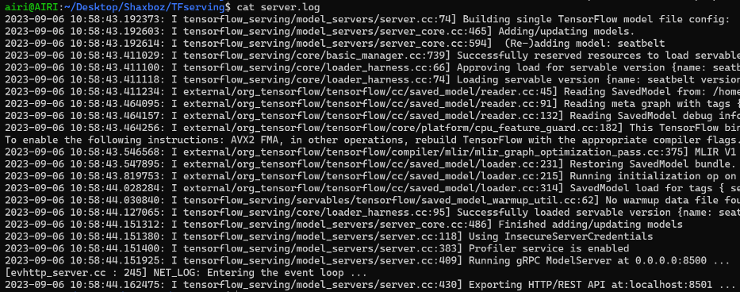

# Deploy tensorflow models with Tensorflow Serving


## Introduction

TensorFlow Serving is a flexible, high-performance serving system for machine learning models, designed for production environments. TensorFlow Serving makes it easy to deploy new algorithms and experiments, while keeping the same server architecture and APIs. TensorFlow Serving provides out-of-the-box integration with TensorFlow models, but can be easily extended to serve other types of models and data.

First of all you need to make sure that you have all the requirements installed, but before proceeding you need to know that TF-Serving is just available for Ubuntu, which means that, in order to use it you will either need a Ubuntu VM or just Docker installed in your OS so as to run a Docker container which deploys TF-Serving.

## Get started

Your Ubuntu VM you need to install tensorflow-model-server, but before being able to install it you need to add the TF-Serving distribution URI as a package source as it follows:

```console
docker pull tensorflow/serving
echo "deb [arch=amd64] http://storage.googleapis.com/tensorflow-serving-apt stable tensorflow-model-server tensorflow-model-server-universal"
sudo tee /etc/apt/sources.list.d/tensorflow-serving.list
curl https://storage.googleapis.com/tensorflow-serving-apt/tensorflow-serving.release.pub.gpg
sudo apt-key add -

sudo apt-get update
sudo apt-get install tensorflow-model-server
```

## 💻 Modelling

In this section, you should create ML model. Then you have to train it with any dataset. And save it to [saved model](https://www.google.com/url?sa=t&rct=j&q=&esrc=s&source=web&cd=&cad=rja&uact=8&ved=2ahUKEwi2257Ln5WBAxVGS_EDHT8vBDAQFnoECBUQAQ&url=https%3A%2F%2Fwww.tensorflow.org%2Ftutorials%2Fkeras%2Fsave_and_load&usg=AOvVaw3laJhbbRfUVm8mrZgDlcuB&opi=89978449). In this project we trained [seatbelt classification model](https://github.com/shoxa0707/SeatBelt-Classification).

Read carefully! After training your model, your model should look like this:

    .
    ├── model
    │   ├── 1
    │   │   ├── assets
    │   │   ├── variables
    │   │   |   ├── variables.data-?????-of-?????
    |   |   |   └── variables.index
    |   |   └── saved_model.pb
    │   ├── 2
    │   │   ├── assets
    │   │   ├── variables
    │   │   |   ├── variables.data-?????-of-?????
    |   |   |   └── variables.index
    |   |   └── saved_model.pb
    |   └── ...
    └── ...

## ⚡ Deploy

### Tensorflow serving

```bash
tensorflow_model_server --port=grpc_port --rest_api_port=rest_port --model_name=model_name --model_base_path=path/to/model >server.log 2>&1
```

if you have everything right, the result should look like this:



or you can also be done with docker:

```bash
docker run -t --rm -p 8501:8501 -v "path/to/model" -e MODEL_NAME=model_name tensorflow/serving
```

but before run that, you must have installed [docker](https://www.digitalocean.com/community/tutorials/how-to-install-and-use-docker-on-ubuntu-22-04) and tensorflow serving:

```bash
docker pull tensorflow/serving
```

### Streamlit

```console
streamlit run stream.py
```

## 👀 Demos

Result of the project is as follows:<br>
Detection model:


and classification model:


You can try detection model in this [link](https://a1be-34-173-35-26.ngrok-free.app).

## 🔧 Dependencies and Installation

#### Requirements

- Python >= 3.9
- Linux (Ubuntu 22.04)

#### Installation

- pip install -r requirements.txt
